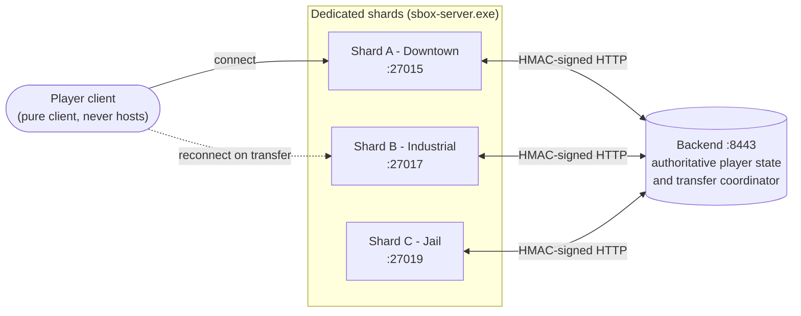
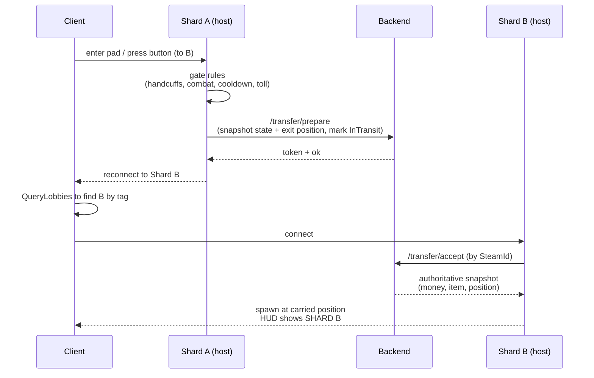
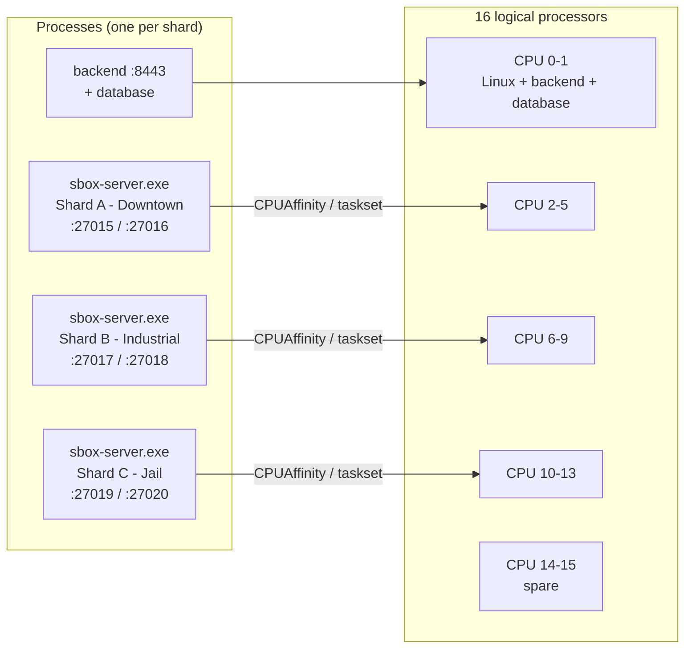

<div align="center">

# SubZeroShardDemo

### Cross-shard player transfer for s&box, proven end-to-end

Move a player between separate dedicated servers ("shards") in real time, carrying their
money, carried item, and state, with all the ways it should not be allowed gated and enforced.


</div>

---

## What is this?

s&box has no built-in way to hand a connected player from one server to another. This is a
minimal, standalone prototype that builds that mechanism by hand and proves it works:

- 3 dedicated shard servers (`A Downtown`, `B Industrial`, `C Jail`), each a separate
  `sbox-server.exe` process running the same game and scene, tinted/labelled per shard.
- A small backend (`http://localhost:8443`) that holds the authoritative shared player
  state (money, carried item, handcuffed, current shard) keyed by SteamId, and coordinates every
  transfer with signed, single-use, expiring tokens.
- Transfer pads / buttons in the world. Walk in (or press <kbd>E</kbd>) and you are moved to
  another shard if you pass the gate rules, arriving where you left off with your state intact.

> The invariant it protects: your money and carried item are never duplicated and never lost,
> across every success and failure path (token expiry, replay, destination full/down, source crash,
> duplicate login).

### What's proven (live, on real dedicated servers)

- A client connects to a dedicated shard (no listen-server / self-hosting anywhere).
- Walking a pad hops the client A to B, reconnecting to the other dedicated server.
- Money and carried item carried exactly (e.g. toll deducts once: $500 to $400, arrives $400).
- Gate rules enforced: `A->C denied: not handcuffed`, `A->B denied: cooldown (3.0s)`.
- Backend authoritative and idempotent (23/23 backend tests, incl. replay / expiry / full / down).

---

## Architecture



- Host authority everywhere: the client only requests and reconnects. Money changes, gate
  checks, token issue/consume and state application all happen server-side.
- The backend is the source of truth: shards keep only local/session state; shared state lives
  in the backend so a failed transfer can never lose it.
- HMAC-SHA256 on every request (signed body envelope), so the backend rejects forgeries.

---

## How a transfer works



If anything fails (token expires, destination full/down, client can't connect), the backend
auto-reverts the `InTransit` lock on its TTL and the player stays put with money intact.

---

## Gate rules

| Pad / button | Allowed when | On pass | On fail |
|---|---|---|---|
| Normal (A to B) | not handcuffed, not in combat (>5s), cooldown ok (>3s) | transfer | denied with reason |
| Toll (to B) | all of the above and money >= $100 | deduct $100 (exactly once) then transfer | `need $100` |
| Prisoner (to C) | player is handcuffed | transfer to Jail | `not handcuffed` |
| any pad | handcuffed players may use only the Prisoner pad | n/a | `handcuffed - jail only` |

---

## Getting started

### Prerequisites
- s&box installed (the dedicated server, `sbox-server.exe`, ships with it, no SteamCMD needed)
- Steam running (satisfies the server's Steam client binaries)
- .NET 10 SDK (for the backend)

### 1. Start the backend
```bat
scripts\run-backend.bat
```
Runs on `http://localhost:8443`. Verify: open `http://localhost:8443/health`, returns `{"ok":true,...}`.

> Backend runs on 8443, not 8080. 8080 is commonly taken (e.g. NVIDIA Broadcast) and 8443 is on
> s&box's localhost HTTP allowlist so the editor and servers can reach it.

### 2. Start the shards
All three at once: double-click `scripts\run-all.bat` (or run it from a terminal); it
confirms, then opens the backend and each shard in its own window:
```bat
scripts\run-all.bat
```
or one at a time:
```bat
scripts\run-shard.bat A     ::  Downtown  (27015)
scripts\run-shard.bat B     ::  Industrial (27017)
scripts\run-shard.bat C     ::  Jail       (27019)
```
Each shard boots headless, creates a Steam lobby (tagged with its shard id), and heartbeats the
backend. Stop everything with `scripts\stop-all.bat`.

### 3. Connect a client
The game must be published once so the client can load the package (`Publish` in the editor).
Then launch the game and, in the console (<kbd>~</kbd>):
```
connect local        # joins a local shard (or pick a shard from the lobby list by name)
```

### 4. Play
- You spawn on a shard. The HUD banner shows which one (SHARD A - DOWNTOWN), your money,
  carried item, flags, and backend status.
- Look at a transfer button and a prompt appears (`Travel to Shard B  [Press E]`); press
  <kbd>E</kbd>. (Or step onto a transition pad.)
- You reconnect to the target shard and arrive at the same spot, money and item carried, unless
  a gate rule blocks you (you will see the reason on the HUD).

---

## Debug commands

Run from the client console; they execute host-side on your player:

| Command | Effect |
|---|---|
| `subzero_setmoney 500` | set your money (via the backend ledger) |
| `subzero_cuffs 1` | handcuff (`1`) / uncuff (`0`) yourself |
| `subzero_item briefcase` | set your carried item (`""` for none) |
| `subzero_combat` | mark just-took-damage (starts the 5s combat lock) |
| `subzero_transfer B` | force a transfer to shard `B` / `C` / `A` |
| `subzero_info` | print shard and player state to the console |

---

## Project layout

```
SubZeroShardDemo/
├─ Code/                     # s&box game C# (compiles in the editor)
│  ├─ Shard/                 # ShardContext, ShardConfig  (per-shard identity + config)
│  ├─ Net/                   # BackendClient, ServerDirectory, ShardNetwork
│  ├─ Transfer/              # TransferService  (gate rules + prepare/accept flow)
│  ├─ Player/                # PlayerWallet, PlayerTestState, PlayerTransfer
│  ├─ World/                 # TransitionZone (pad), TransitionButton (press E)
│  ├─ UI/                    # DebugHud.razor  (HUD + prompts)
│  ├─ Debug/                 # console commands
│  └─ Shared/                # Hmac (managed SHA-256), TransferProtocol (DTOs)
├─ backend/                  # standalone .NET 10 service (player store + transfer coordinator)
│  └─ smoke-test.ps1         #   exercises the whole state machine over HTTP (23 checks)
├─ config/                   # shard.A/B/C.json  (ports, capacity, secret, peers)
├─ scripts/                  # run-backend.bat, run-shard.bat, run-all.ps1, stop-all.ps1
└─ Assets/scenes/            # subzerosharddemo.scene  (the shared world)
```

---

## Ports

| | Game | Query | |
|---|---|---|---|
| Shard A - Downtown | 27015 | 27016 | |
| Shard B - Industrial | 27017 | 27018 | |
| Shard C - Jail | 27019 | 27020 | |
| Backend | 8443 | n/a | `http://localhost:8443` |

Clients connect via the Steam lobby / loopback, not IP:port. The ports just keep the local
processes from colliding.

---

## Configuration

Per-shard config lives in `config/shard.{A,B,C}.json` (display name, ports, backend URL, capacity,
peers, shared secret). Each shard learns which one it is from the `+subzero_shard <id>` launch arg.
The HMAC secret is baked for the demo and matches the backend default; override everywhere with the
`SHARD_DEMO_SECRET` env var for anything real.

---

## Notes and constraints

- Dedicated-servers-only by design: a client always connects to a shard and never hosts one
  (enforced via `Application.IsDedicatedServer`).
- A dedicated server can't read its own lobby id, so clients discover a target shard's lobby by
  its `shardid` tag (`QueryLobbies` is client-side) and connect to it.
- This is a throwaway prototype, not a framework. The shared secret is committed, the map is
  primitive, and the goal is proving the mechanism, not shipping it.

---

## Running shards on separate CPU cores

Each shard is its own `sbox-server.exe` process, so putting shards on different CPU cores is a
matter of process CPU affinity, not code changes. You assign the whole shard process to a group of
logical processors; you do not assign individual pieces of game code to a thread. This section
covers Windows affinity, a Linux/systemd production setup, and database/monitoring/scaling notes.

### CPU core layout (16-core example)



### Overview
The SubZeroShardDemo already uses the correct architecture for assigning shards to different CPU cores.
Each shard runs as its own dedicated s&box server process:
* Shard A: Downtown
* Shard B: Industrial
* Shard C: Jail
* Shared transfer backend
* Shared player state

Each shard uses:
* Its own `sbox-server.exe` process
* Its own game port
* Its own query port
* Its own shard identifier
* The same game project and codebase
* A shared backend for persistent player state and transfers

This means each shard can be assigned to a different group of CPU cores or logical processors.
The important distinction is that you assign the entire shard process to CPU cores. You do not assign individual pieces of game code to a specific CPU thread.

### Windows dedicated server

#### Can each shard use different CPU cores?
Yes.
Windows supports CPU affinity. CPU affinity controls which logical processors a process is allowed to use.
For example, on a server with 16 logical processors:

| Process             | Logical processors |
| ------------------- | -----------------: |
| Shard A             |             0 to 3 |
| Shard B             |             4 to 7 |
| Shard C             |            8 to 11 |
| Backend and Windows |           12 to 15 |

Each shard can still create multiple internal threads, but all of those threads will remain inside the assigned CPU group.

#### Current shard launcher
The current shard script launches each shard as a separate process:
```bat
"%SBOX_SERVER%" +game "%PROJECT%" +hostname "%NAME%" +port %PORT% +net_query_port %QPORT% +net_allow_local 1 +subzero_shard %SHARD% -allowlocalhttp
```

#### Add CPU affinity
Add the following before the server launch command:
```bat
rem Assign each shard a group of logical processors.
set "AFFINITY="
if /I "%SHARD%"=="A" set "AFFINITY=F"
if /I "%SHARD%"=="B" set "AFFINITY=F0"
if /I "%SHARD%"=="C" set "AFFINITY=F00"
```
Then replace the existing launch command with:
```bat
start "Shard %SHARD%" /wait /affinity %AFFINITY% "%SBOX_SERVER%" ^
    +game "%PROJECT%" ^
    +hostname "%NAME%" ^
    +port %PORT% ^
    +net_query_port %QPORT% ^
    +net_allow_local 1 ^
    +subzero_shard %SHARD% ^
    -allowlocalhttp
```

#### Windows affinity masks
Windows uses hexadecimal affinity masks.
Example masks:

| Logical processors | Hex mask |
| ------------------ | -------: |
| CPU 0              |      `1` |
| CPU 0 to 1         |      `3` |
| CPU 0 to 3         |      `F` |
| CPU 4 to 7         |     `F0` |
| CPU 8 to 11        |    `F00` |
| CPU 12 to 15       |   `F000` |

The exact masks depend on the CPU layout of the server.

#### Do not assign only one CPU thread per shard
A dedicated game server may use several internal threads for:
* Networking
* Physics
* Garbage collection
* File access
* Engine tasks
* Background workers

Restricting a shard to one logical processor may reduce performance.
A more reasonable starting point is:

| Shard type                    | Suggested logical processors |
| ----------------------------- | ---------------------------: |
| Small or low population shard |                            2 |
| Normal shard                  |                            4 |
| Physics heavy shard           |                       4 to 8 |
| Backend                       |                       1 to 2 |

Measure actual server performance before finalizing the CPU layout.

### Linux dedicated server
A dedicated Linux server is a good production option for this shard system.
Linux makes it easy to:
* Assign processes to CPU cores
* Automatically restart crashed shards
* Start shards after a reboot
* Separate logs for each shard
* Limit memory and CPU usage
* Run the backend as a managed service
* Run multiple shard instances from one template

#### Recommended architecture
```text
Linux Dedicated Server
|
|-- Shard A
|   |-- Separate s&box server process
|   |-- Dedicated CPU group
|   |-- Game port 27015
|   `-- Query port 27016
|
|-- Shard B
|   |-- Separate s&box server process
|   |-- Dedicated CPU group
|   |-- Game port 27017
|   `-- Query port 27018
|
|-- Shard C
|   |-- Separate s&box server process
|   |-- Dedicated CPU group
|   |-- Game port 27019
|   `-- Query port 27020
|
|-- Transfer backend
|
|-- Shared database
|
`-- Shard manager
    |-- Starts shards
    |-- Restarts crashed shards
    |-- Assigns ports
    |-- Tracks player counts
    `-- Starts additional instances
```

### Installing the s&box dedicated server on Linux
The dedicated server can be installed through SteamCMD.
Example:
```bash
./steamcmd.sh \
  +login anonymous \
  +app_update 1892930 validate \
  +quit
```
The dedicated server may require access to `steamclient.so`.
Example setup:
```bash
mkdir -p /home/sbox/.steam/sdk64
ln -s \
  /home/sbox/steamcmd/linux64/steamclient.so \
  /home/sbox/.steam/sdk64/steamclient.so
```
Run the dedicated server using the same Linux user that owns the Steam and server directories.
A dedicated user is recommended:
```bash
sudo useradd --create-home --shell /bin/bash sbox
```
Suggested directories:
```text
/opt/sbox
/srv/subzero/SubZeroShardDemo
/var/log/subzero
/home/sbox/.steam
```

### Assigning CPU cores with taskset
The simplest method is `taskset`.
Example for Shard A:
```bash
taskset --cpu-list 0-3 ./sbox-server.exe \
  +game "/srv/subzero/SubZeroShardDemo/subzerosharddemo.sbproj" \
  +hostname "SubZero Shard A - Downtown" \
  +port 27015 \
  +net_query_port 27016 \
  +subzero_shard A \
  -allowlocalhttp
```
This allows Shard A to use logical processors 0 through 3.

#### Example Linux launcher
```bash
#!/usr/bin/env bash
set -euo pipefail
SERVER="/opt/sbox/sbox-server.exe"
PROJECT="/srv/subzero/SubZeroShardDemo/subzerosharddemo.sbproj"
LOG_DIR="/var/log/subzero"
mkdir -p "$LOG_DIR"
taskset --cpu-list 0-3 "$SERVER" \
  +game "$PROJECT" \
  +hostname "SubZero Shard A - Downtown" \
  +port 27015 \
  +net_query_port 27016 \
  +subzero_shard A \
  -allowlocalhttp \
  > "$LOG_DIR/shard-a.log" 2>&1 &
taskset --cpu-list 4-7 "$SERVER" \
  +game "$PROJECT" \
  +hostname "SubZero Shard B - Industrial" \
  +port 27017 \
  +net_query_port 27018 \
  +subzero_shard B \
  -allowlocalhttp \
  > "$LOG_DIR/shard-b.log" 2>&1 &
taskset --cpu-list 8-11 "$SERVER" \
  +game "$PROJECT" \
  +hostname "SubZero Shard C - Jail" \
  +port 27019 \
  +net_query_port 27020 \
  +subzero_shard C \
  -allowlocalhttp \
  > "$LOG_DIR/shard-c.log" 2>&1 &
wait
```
Make the script executable:
```bash
chmod +x run-all-shards.sh
```
Run it:
```bash
./run-all-shards.sh
```
This works well for testing, but `systemd` is better for production.

### Production setup with systemd
`systemd` can manage every shard as an independent service.
Benefits include:
* Automatic restart after a crash
* Automatic startup after reboot
* Separate logs
* CPU affinity
* Memory limits
* Clean start and stop commands
* Service health status

#### Shard service template
Create:
```text
/etc/systemd/system/subzero-shard@.service
```
Contents:
```ini
[Unit]
Description=SubZero s&box Shard %i
Wants=network-online.target
After=network-online.target subzero-backend.service
Requires=subzero-backend.service
[Service]
Type=simple
User=sbox
Group=sbox
WorkingDirectory=/srv/subzero/SubZeroShardDemo
ExecStart=/usr/local/bin/run-subzero-shard %i
Restart=on-failure
RestartSec=5
LimitNOFILE=65535
KillSignal=SIGTERM
TimeoutStopSec=30
[Install]
WantedBy=multi-user.target
```

### Shard launch script
Create:
```text
/usr/local/bin/run-subzero-shard
```
Contents:
```bash
#!/usr/bin/env bash
set -euo pipefail
SHARD="${1^^}"
SERVER="/opt/sbox/sbox-server.exe"
PROJECT="/srv/subzero/SubZeroShardDemo/subzerosharddemo.sbproj"
case "$SHARD" in
  A)
    NAME="SubZero Shard A - Downtown"
    PORT="27015"
    QUERY_PORT="27016"
    ;;
  B)
    NAME="SubZero Shard B - Industrial"
    PORT="27017"
    QUERY_PORT="27018"
    ;;
  C)
    NAME="SubZero Shard C - Jail"
    PORT="27019"
    QUERY_PORT="27020"
    ;;
  *)
    echo "Unknown shard: $SHARD" >&2
    exit 1
    ;;
esac
exec "$SERVER" \
  +game "$PROJECT" \
  +hostname "$NAME" \
  +port "$PORT" \
  +net_query_port "$QUERY_PORT" \
  +subzero_shard "$SHARD" \
  -allowlocalhttp
```
Make it executable:
```bash
sudo chmod +x /usr/local/bin/run-subzero-shard
```

### Assigning CPU cores with systemd
Create a separate CPU configuration for each shard.

#### Shard A
Create:
```text
/etc/systemd/system/subzero-shard@A.service.d/cpu.conf
```
Contents:
```ini
[Service]
CPUAffinity=0-3
```

#### Shard B
Create:
```text
/etc/systemd/system/subzero-shard@B.service.d/cpu.conf
```
Contents:
```ini
[Service]
CPUAffinity=4-7
```

#### Shard C
Create:
```text
/etc/systemd/system/subzero-shard@C.service.d/cpu.conf
```
Contents:
```ini
[Service]
CPUAffinity=8-11
```
Create the override directories if needed:
```bash
sudo mkdir -p /etc/systemd/system/subzero-shard@A.service.d
sudo mkdir -p /etc/systemd/system/subzero-shard@B.service.d
sudo mkdir -p /etc/systemd/system/subzero-shard@C.service.d
```

### Starting the shards
Reload systemd:
```bash
sudo systemctl daemon-reload
```
Enable the services at boot:
```bash
sudo systemctl enable subzero-backend.service
sudo systemctl enable subzero-shard@A.service
sudo systemctl enable subzero-shard@B.service
sudo systemctl enable subzero-shard@C.service
```
Start everything:
```bash
sudo systemctl start subzero-backend.service
sudo systemctl start subzero-shard@A.service
sudo systemctl start subzero-shard@B.service
sudo systemctl start subzero-shard@C.service
```
You can also enable and start them in one command:
```bash
sudo systemctl enable --now \
  subzero-backend.service \
  subzero-shard@A.service \
  subzero-shard@B.service \
  subzero-shard@C.service
```

### Checking service status
Check a shard:
```bash
systemctl status subzero-shard@A
```
Check all shard services:
```bash
systemctl status "subzero-shard@*"
```
Restart a shard:
```bash
sudo systemctl restart subzero-shard@A
```
Stop a shard:
```bash
sudo systemctl stop subzero-shard@A
```
Start a shard:
```bash
sudo systemctl start subzero-shard@A
```

### Viewing logs
Follow Shard A logs:
```bash
journalctl -u subzero-shard@A -f
```
Follow Shard B logs:
```bash
journalctl -u subzero-shard@B -f
```
Follow Shard C logs:
```bash
journalctl -u subzero-shard@C -f
```
View recent logs:
```bash
journalctl -u subzero-shard@A --since "30 minutes ago"
```

### Example CPU layout
For a server with 16 logical processors:

| Workload               | Logical processors |
| ---------------------- | -----------------: |
| Linux operating system |             0 to 1 |
| Backend and database   |             0 to 1 |
| Shard A                |             2 to 5 |
| Shard B                |             6 to 9 |
| Shard C                |           10 to 13 |
| Spare capacity         |           14 to 15 |

This layout leaves room for:
* Linux background services
* Database activity
* Backend requests
* Monitoring
* Temporary CPU spikes
* Future shard management tools

### Check the CPU topology
Run:
```bash
lscpu
```
For a detailed CPU layout:
```bash
lscpu --extended
```
This shows:
* Logical CPU number
* Physical core number
* Socket
* NUMA node
* Online status

Example:
```text
CPU NODE SOCKET CORE
0   0    0      0
1   0    0      0
2   0    0      1
3   0    0      1
```
CPUs 0 and 1 may be two threads belonging to the same physical core.
When possible, assign complete physical cores to one shard instead of splitting both threads of one physical core between two busy shards.

### Physical cores and SMT
Modern CPUs often expose two logical processors per physical core.
This is commonly called:
* SMT on AMD
* Hyper-Threading on Intel

For predictable game server performance:
* Keep both logical threads of a physical core assigned to the same shard
* Avoid assigning one sibling thread to Shard A and the other to Shard B
* Reserve some physical cores for Linux and backend services
* Test under actual player load

CPU affinity improves consistency, but it does not automatically improve performance in every situation.
If one shard is overloaded while another is nearly empty, strict affinity may prevent Linux from using idle CPU capacity.
A good initial approach is to use relatively large CPU groups, then adjust them after collecting performance data.

### Dedicated server versus VPS

#### Dedicated physical server
A dedicated physical server is the best option for predictable shard performance.
Advantages:
* Full control over the CPU
* No noisy neighbours
* Reliable core allocation
* Better sustained performance
* Better control over memory and storage
* More predictable server tick times

#### VPS
CPU affinity also works on a VPS, but only within the virtual CPUs assigned to the VPS.
The hosting provider still controls where those virtual CPUs run on the physical host.
A low cost VPS may have:
* Shared CPU time
* Oversold CPU resources
* Inconsistent performance
* Reduced sustained clock speed
* Other customers using the same physical cores

A VPS with dedicated vCPUs is much better than a shared CPU VPS.
For production s&box shards, choose one of the following:
1. Dedicated physical server
2. Bare metal cloud server
3. VPS with dedicated vCPUs
4. Shared CPU VPS only for testing

### Backend placement
If all shards are on the same machine, the backend can listen only on localhost:
```text
http://127.0.0.1:8443
```
This prevents the backend from being directly exposed to the internet.
The shard processes can still access it locally.
Do not publicly expose the backend unless it has:
* Authentication
* TLS
* Firewall rules
* Rate limiting
* Request validation
* Secure secret management

The current demo uses HMAC signed requests between the shards and backend.
For production, the shared secret should not be committed to the repository.
Store it in an environment variable:
```bash
export SHARD_DEMO_SECRET="replace-with-a-secure-secret"
```
With systemd:
```ini
[Service]
EnvironmentFile=/etc/subzero/subzero.env
```
Example environment file:
```text
SHARD_DEMO_SECRET=replace-with-a-secure-secret
```
Permissions:
```bash
sudo chmod 600 /etc/subzero/subzero.env
sudo chown root:root /etc/subzero/subzero.env
```

### Database recommendation
For a production shard system, use a shared database for persistent state.
Recommended:
* PostgreSQL for persistent player and world data
* Redis for temporary coordination, caching, locks or presence
* Regular database backups
* Database migrations stored in the repository
* Server authoritative transactions
* Unique identifiers for transfer operations
* Idempotent transfer requests

Possible PostgreSQL data includes:
* Player money
* Inventory
* Jobs
* Character data
* Property ownership
* Current shard
* Last known position
* Punishments
* Permissions
* Organization data
* Economy history

Redis could be used for:
* Online player presence
* Short transfer locks
* Shard heartbeat status
* Temporary matchmaking data
* Rate limiting
* Pub and sub messages

Redis should not be the only persistent source of important player data.

### Dynamic shard scaling
The same architecture can support more than three shards.
Example:
```text
Downtown 1
Downtown 2
Downtown 3
Industrial 1
Industrial 2
Jail 1
Event Server
Character Creation
Tutorial
```
Each instance would need:
* Unique shard ID
* Unique game port
* Unique query port
* Unique lobby tags
* Registered capacity
* Heartbeat to the backend
* CPU allocation
* Health monitoring

Example shard IDs:
```text
downtown-01
downtown-02
industrial-01
jail-01
tutorial-01
```
The backend could choose a destination based on:
* Current player count
* Shard capacity
* Region
* Ping
* Party membership
* Roleplay district
* Server health
* Maintenance status

### Shard manager
A future shard manager could be responsible for:
* Starting and stopping shard services
* Assigning ports
* Assigning CPU affinity
* Checking player counts
* Checking shard health
* Restarting failed shards
* Starting overflow shards
* Draining shards before maintenance
* Preventing new joins
* Moving players to another shard
* Updating the shard directory
* Recording metrics

The shard manager should not store authoritative player data itself.
The database and backend should remain authoritative.

### Monitoring
Useful Linux tools include:
```bash
htop
```
```bash
top
```
```bash
pidstat
```
```bash
mpstat
```
```bash
iostat
```
Check the CPU affinity of a running process:
```bash
taskset -cp PROCESS_ID
```
Find shard processes:
```bash
pgrep -af sbox-server
```
Show CPU usage by process:
```bash
ps -eo pid,psr,pcpu,pmem,cmd | grep sbox-server
```
Useful production monitoring tools include:
* Prometheus
* Grafana
* Loki
* Netdata
* Uptime Kuma
* systemd watchdog
* PostgreSQL monitoring

Important metrics include:
* CPU usage per shard
* Memory usage per shard
* Player count
* Server tick time
* Frame time
* Network traffic
* Transfer failures
* Backend response time
* Database query time
* Shard restarts
* Shard heartbeat failures

### Firewall
The required game and query ports must be allowed through the firewall.
Example with UFW:
```bash
sudo ufw allow 27015/udp
sudo ufw allow 27016/udp
sudo ufw allow 27017/udp
sudo ufw allow 27018/udp
sudo ufw allow 27019/udp
sudo ufw allow 27020/udp
```
SSH should also be allowed:
```bash
sudo ufw allow OpenSSH
```
Enable the firewall:
```bash
sudo ufw enable
```
Do not expose the backend port if it only needs to be accessed locally.

### Recommended initial server
For an initial three shard deployment:
* Linux dedicated server
* Ubuntu Server LTS or Debian
* Modern high clock speed CPU
* At least 8 physical cores
* At least 16 logical processors
* 32 GB RAM
* NVMe storage
* Stable gigabit networking
* PostgreSQL
* systemd services
* Local backend on port 8443
* Separate CPU groups for each shard
* At least two logical processors reserved for Linux and shared services

High single core performance is important for game servers.
A processor with fewer fast cores may perform better than a processor with many slow cores.

### Final recommendation
Use a dedicated Linux server and run each shard as a separate systemd service.
Assign each shard to a group of physical CPU cores rather than one individual CPU thread.
A good initial setup is:
```text
Linux and shared services: CPUs 0 to 1
Shard A: CPUs 2 to 5
Shard B: CPUs 6 to 9
Shard C: CPUs 10 to 13
Spare capacity: CPUs 14 to 15
```
Use:
* `systemd` for process management
* `CPUAffinity` for CPU allocation
* PostgreSQL for shared persistent data
* Redis only for temporary coordination
* Localhost networking for the transfer backend
* Steam lobbies or the supported s&box connection system for players
* A shard manager later for automatic scaling

The current SubZeroShardDemo architecture is already suitable for this because every shard runs as its own dedicated server process.
